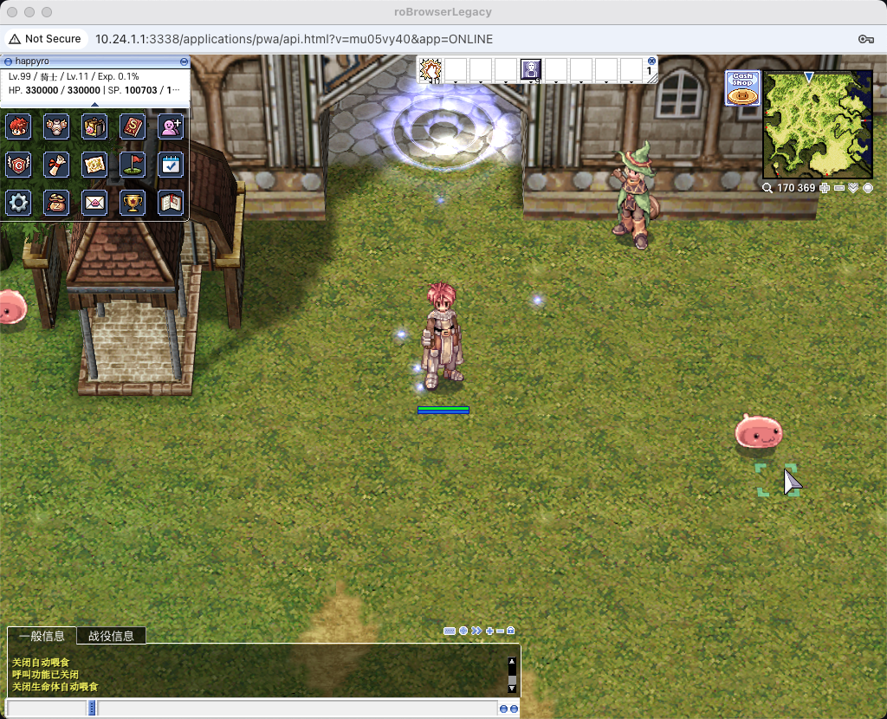
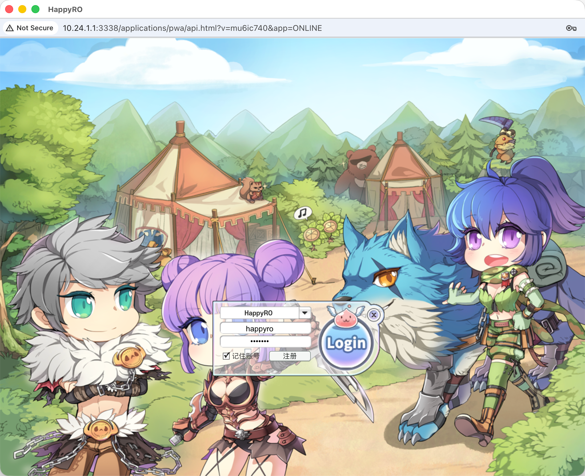
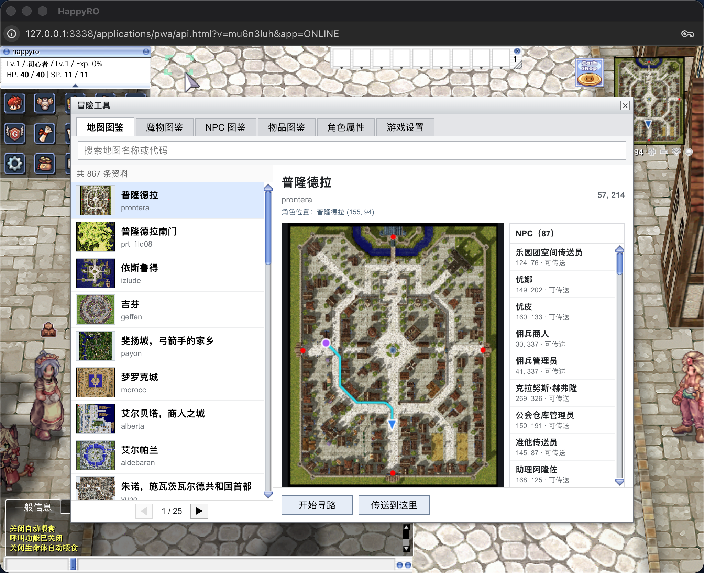
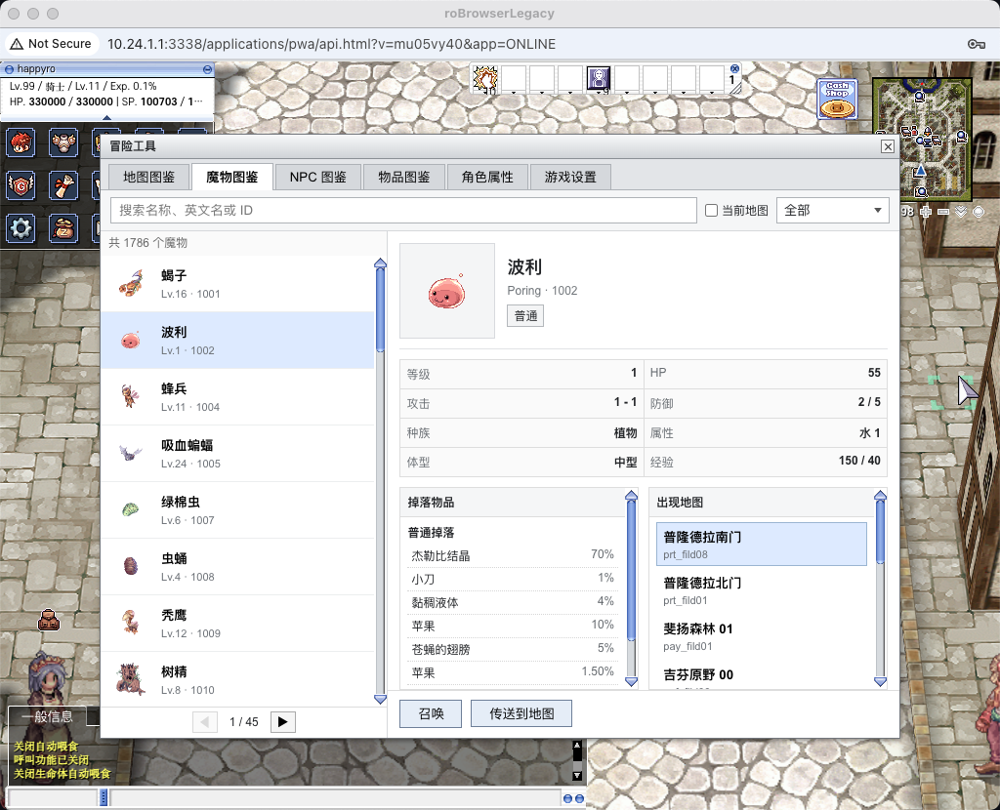
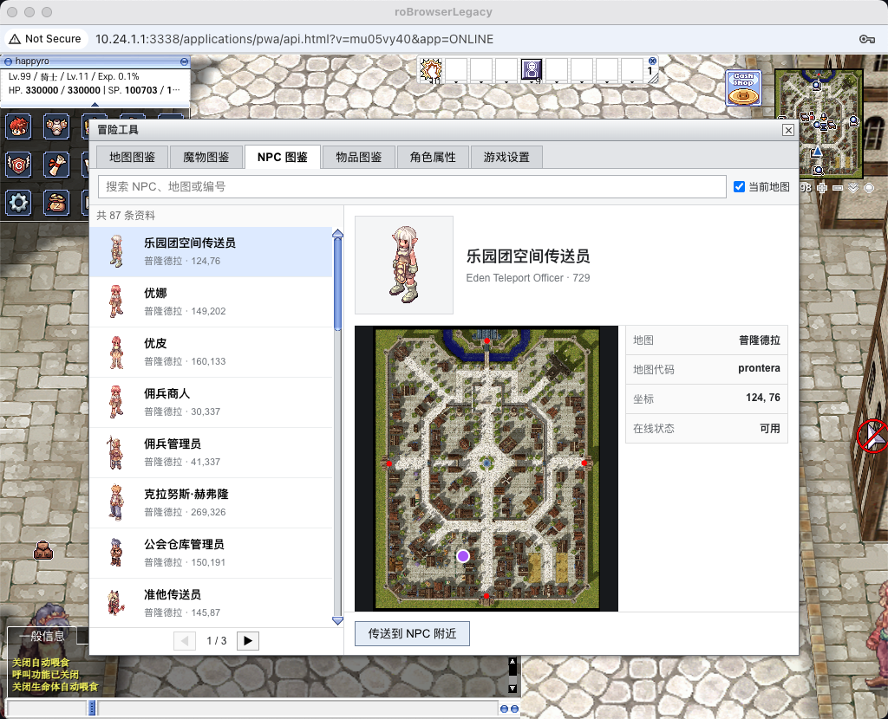
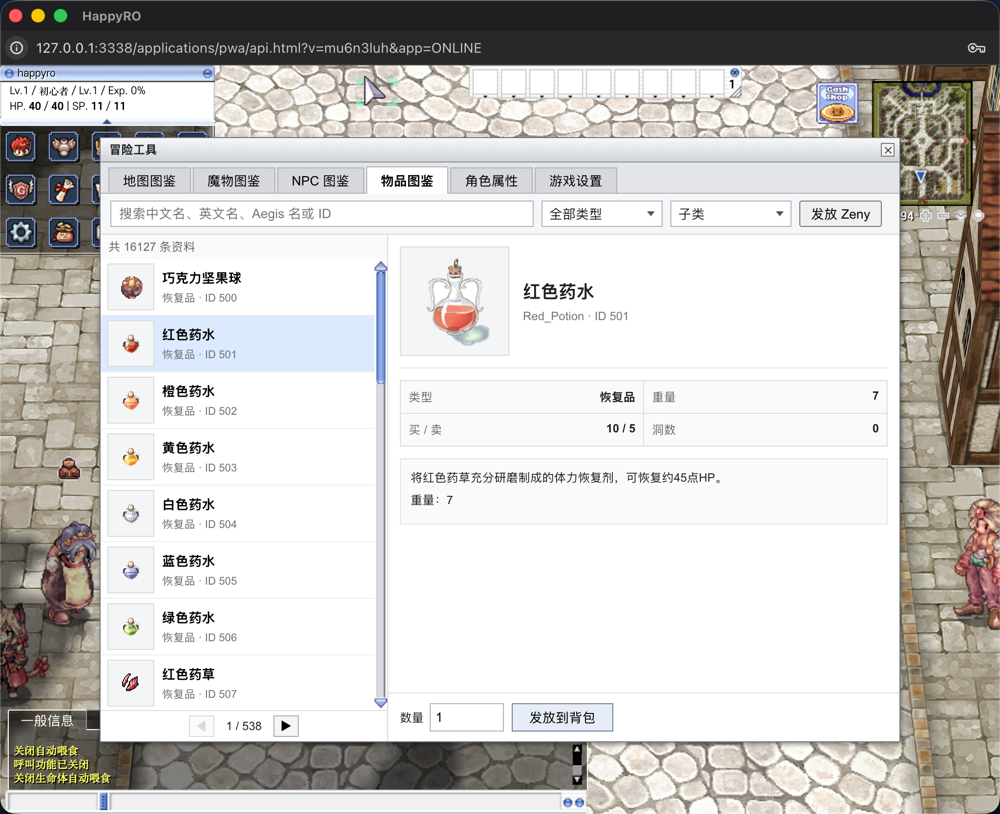
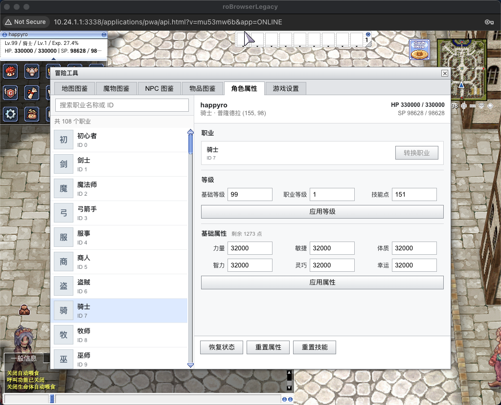
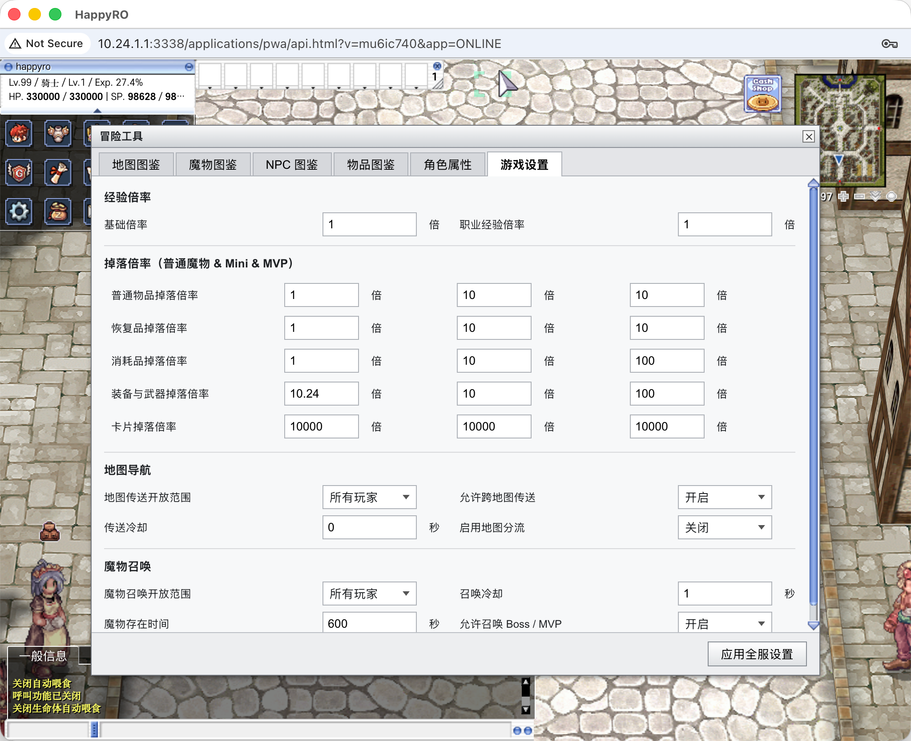
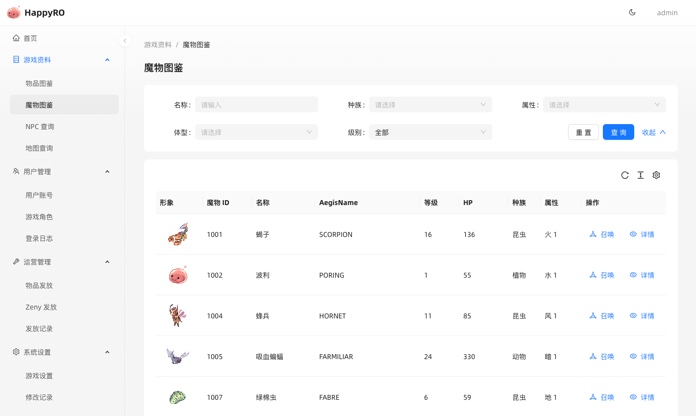
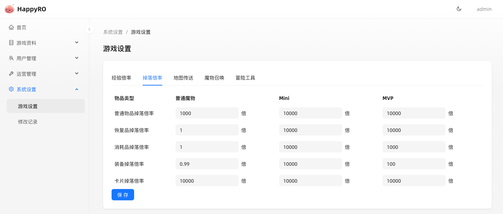

<div align="center">

<h1>HappyRO</h1>

<p>基于 roBrowserLegacy 与 rAthena 的开源中文《仙境传说 Online》Web 项目</p>

<p>
  <a href="https://happyro-demo.kugarocks.com/applications/pwa/index.html">在线体验</a> ·
  <a href="https://happyro.kugarocks.com/downloads">资源下载</a> ·
  <a href="docs/README.md">项目文档</a> ·
  <a href="https://happyro.kugarocks.com/installation/docker">Docker 安装</a>
</p>

<p></p>

</div>

## 项目说明

HappyRO 希望让大家轻松玩到中文《仙境传说 Online》：打开浏览器，登录、创建角色，就能进入熟悉的世界，无需安装桌面客户端。你可以探索地图、查阅图鉴，也可以在自己的体验环境中尝试不同职业、装备和游戏节奏。

### 体验特色

- 浏览器游玩：从登录、选择角色到进入地图，都在网页中完成，也可使用启动页中的资源查看器。
- 中文本地化：客户端 UI、系统消息、物品、技能、魔物、地图和 NPC。
- 中文图鉴：随时查询物品、魔物、地图和 NPC，寻找下一处冒险目的地。
- 自由尝试：在具备相应权限的体验环境中调整角色、获取装备、召唤魔物或传送，探索不同玩法。
- 自己动手体验：提供 `linux/amd64` 与 `linux/arm64` 离线包，方便在自己的设备上安装和游玩。

## 游戏画面

### 登录与游戏世界



在浏览器中登录并创建角色，即可探索地图、与 NPC 对话、挑战魔物，体验技能、聊天和熟悉的游戏音效。自己安装离线包后，可使用初始体验账号 `happyro / happyro` 进入游戏；该账号具有 GM 权限，方便尝试冒险工具。

### 冒险工具

游戏内的冒险工具把图鉴查询和玩法体验放在同一个窗口中。查地图、找 NPC、看装备时无需离开游戏；角色调整、召唤和传送等功能按账号权限开放。

#### 地图图鉴



地图图鉴提供中文名称、地图代码、缩略图、当前角色位置和 NPC 坐标。支持按名称或代码搜索、路线预览、自动寻路，以及权限允许时的地图传送。

#### 魔物图鉴



魔物图鉴展示等级、HP、种族、属性、经验、掉落物品和出现地图。可以用它寻找练级地点、了解掉落，也可在具备权限时召唤魔物或传送到对应地图进行体验。

#### NPC 图鉴



NPC 图鉴展示游戏中 NPC 的中文名称、形象、所在地图和精确坐标，帮助你找到想拜访的角色。可筛选当前地图并在地图上定位；具备权限时可以传送至 NPC 附近。

#### 物品图鉴



物品图鉴支持按中文名、英文名、AegisName 或 ID 搜索，并展示图标、插画、类型、重量、价格、洞数和中文说明。具备权限时，可以为当前角色添加物品或 Zeny，方便试用装备和道具。

#### 角色属性



角色属性页汇总职业、等级、技能点、基础属性和生命状态。具备权限时，可以切换职业、调整等级和属性、恢复状态或重置加点，尝试不同的角色搭配。

#### 游戏设置



在自己的体验环境中，可以通过游戏设置调整经验与分类掉落倍率，以及地图传送、地图分流和魔物召唤等选项，选择适合自己的探索节奏。设置修改需要相应权限。

## 网页辅助工具

HappyRO Admin 提供独立的网页界面，方便在游戏之外查阅资料、调整角色和体验设置。自己安装后，可以用它准备想尝试的装备、魔物和游戏参数。

自行安装离线包后，可使用初始账号 `admin / admin` 登录辅助工具。该账号与游戏账号独立。



魔物图鉴支持按名称、种族、属性、体型和首领类型组合查询，帮助你了解魔物特点、寻找想挑战的对手，也可通过召唤入口进行体验。



经验、掉落、地图传送、魔物召唤和冒险工具的设置按类别展示，方便按自己的喜好调整体验。

## 项目组成

HappyRO 由一个编排仓库和四个独立应用仓库组成：

| 仓库 | 职责 |
| --- | --- |
| 当前根仓库 | 部署脚本、配置、本地化资源、文档和发布编排 |
| [happyro-client](https://github.com/happyro/happyro-client) | 浏览器客户端、PWA 与游戏内冒险工具 |
| [happyro-server](https://github.com/happyro/happyro-server) | rAthena 登录、角色、地图和 Web API 服务 |
| [happyro-gateway](https://github.com/happyro/happyro-gateway) | Node.js 网关、静态资源、HTTP 与 WebSocket 代理 |
| [happyro-admin](https://github.com/happyro/happyro-admin) | 网页辅助工具、Laravel API 与 Ant Design Pro 前端 |

详细调用关系见[系统概览](docs/architecture/system-overview.md)，代码和资源归属见[仓库边界](docs/architecture/repository-boundaries.md)。

## 技术基线

| 项目 | 版本或基线 |
| --- | --- |
| kRO 客户端资源 | 2021-11-05（`RAG_SETUP_211105.exe`） |
| `PACKETVER` | `20211103` |
| 服务端模式 | Renewal |
| [rAthena](https://github.com/rathena/rathena) | `master` @ [`2fe6ab3dc4d8`](https://github.com/rathena/rathena/commit/2fe6ab3dc4d830b11d93fb44c3b48436571890bd) |
| [roBrowserLegacy](https://github.com/MrAntares/roBrowserLegacy) | `master` @ [`402e61ce7ae8`](https://github.com/MrAntares/roBrowserLegacy/commit/402e61ce7ae80cd45c76365371d4dbfd6aa10f49) |
| Node.js | 22 或更高版本 |
| MariaDB | 10.11 |
| LUB 工具链 | Lua 5.0.2、Lua 5.1.5 |

上游提交是 `versions/sources.lock` 记录的选定起点，不代表各应用仓库当前 HEAD。实际产品版本以 Git tag、离线包发布清单和镜像 digest 为准。

## 本地体验与开发

想在自己的设备上游玩，可以使用完整离线包，其中包含双架构镜像、kRO 运行资源、配置模板和配套工具。设备需安装 Docker Engine、Compose v2 和 Python 3.11+；安装过程不需要源码、Node.js、PHP、Skopeo 或镜像仓库连接。具体步骤见[离线安装手册](docs/operations/docker-deployment.md)。

本机源码开发通过根仓库 `Makefile` 和 systemd 管理游戏进程，MariaDB 使用 Compose：

```bash
make database-start
make configure-server
make build-server
make server-start
make configure-client
make configure-gateway
make configure-resources
(cd repos/happyro-client && npm install && npm run build:pwa)
make doctor
make gateway-start
```

浏览器打开 <http://127.0.0.1:3338/applications/pwa/index.html>。依赖安装、资源准备和常用命令见[本地开发](docs/development/local-setup.md)。

## 文档导航

| 入口 | 内容 |
| --- | --- |
| [文档总览](docs/README.md) | 安装、开发、架构、本地化和游戏资料入口 |
| [系统概览](docs/architecture/system-overview.md) | 浏览器、Gateway、Server 与 Admin 的运行关系 |
| [本地开发](docs/development/local-setup.md) | 环境准备、构建、启动和检查 |
| [运行与排查](docs/operations/services.md) | 服务、端口、启停和日志 |
| [离线安装](docs/operations/docker-deployment.md) | 完整离线包的初始化、升级、备份和恢复 |
| [本地化](docs/localization/overview.md) | 中文资源、覆盖链和校验 |
| [游戏资料](docs/game-data/README.md) | 物品、魔物、地图、NPC 和技能目录 |

## 站点与社区

- 项目站点：[happyro.kugarocks.com](https://happyro.kugarocks.com)
- GitHub Pages：[happyro.org](https://happyro.org)
- 安装教程：[Docker](https://happyro.kugarocks.com/installation/docker) / [Linux](https://happyro.kugarocks.com/installation/linux) / [macOS](https://happyro.kugarocks.com/installation/macos) / [Windows](https://happyro.kugarocks.com/installation/windows)
- QQ 群：`662191549`（HappyRO）

## 开源协议

[GNU General Public License v3.0](LICENSE)
