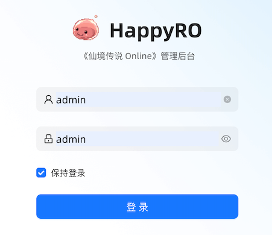

# HappyRO

HappyRO 是一个基于 [roBrowserLegacy](https://github.com/MrAntares/roBrowserLegacy) 与 [rAthena](https://github.com/rathena/rathena) 构建的开源中文《仙境传说 Online》Web 项目。玩家打开浏览器即可登录、创建角色并进入游戏，无需安装桌面客户端；GM 可以通过独立管理后台维护玩家、资料和游戏参数。

[在线演示](https://happyro-demo.kugarocks.com/applications/pwa/index.html) · [项目文档](docs/README.md) · [Docker 安装](https://happyro.kugarocks.com/installation/docker)

## 浏览器里的 RO

客户端以完整 PWA 形式运行，保留 RO 的登录、选角、地图、战斗和聊天体验，并提供适合中文玩家与服务器运营的内置工具。


登录界面直接运行在浏览器中，连接 HappyRO Gateway 转发的登录、角色和地图服务。默认离线部署会创建游戏 GM 账号 `happyro / happyro`。


进入世界后可使用原生地图、角色、魔物、NPC、技能、聊天和音效资源。当前项目固定使用 kRO 2021-11-05 客户端资源、`PACKETVER=20211103` 和 Renewal 模式。

## 冒险工具

游戏内的冒险工具把常用资料查询和 GM 操作放在同一个窗口中。地图、魔物、NPC 和物品采用统一中文目录，查询结果与当前游戏世界联动。

### 地图图鉴与导航


地图图鉴提供中文名称、地图代码、缩略图、当前角色位置和 NPC 坐标。支持按名称或代码搜索、路线预览、自动寻路，以及权限允许时的地图传送。

### 魔物图鉴


魔物图鉴展示等级、HP、种族、属性、经验、掉落物品和出现地图。GM 可以从图鉴召唤魔物或传送到对应地图，普通玩家仍可将它作为完整资料库使用。

### NPC 图鉴


NPC 图鉴整合服务器 NPC 实例、中文名称、形象、地图和精确坐标，可筛选当前地图并在地图上定位；具备权限时可以传送至 NPC 附近。

### 物品图鉴


物品图鉴支持按中文名、英文名、AegisName 或 ID 搜索，并展示图标、插画、类型、重量、价格、洞数和中文说明。GM 可以直接向当前角色发放物品或 Zeny。

### 角色维护


角色属性页汇总职业、等级、技能点、基础属性和生命状态。GM 可以调整职业与等级、应用属性，以及执行状态恢复、属性重置和技能重置。

### 游戏设置


游戏设置覆盖经验倍率、分类掉落倍率、地图传送、地图分流和魔物召唤。修改经由 Admin 与 Game Control 应用到服务器，并保留统一的服务端校验。

## GM 管理后台

HappyRO Admin 是独立的 Laravel API 与 Ant Design Pro 应用，面向服务器管理人员。它提供游戏资料、用户管理、运营发放、在线控制、配置修改和审计记录。



后台不开放注册。离线部署首次初始化会创建 `admin / admin` 超级管理员账号；其他后台用户由管理员通过命令或后台权限体系维护。


后台魔物图鉴支持按名称、种族、属性、体型和首领类型组合查询，集中展示魔物形象与关键数值，并提供详情查看和在线召唤入口。


游戏参数按经验、掉落、地图传送、魔物召唤和冒险工具分组维护。每项设置标明对应 rAthena 配置来源，保存后进入统一修改记录。

## 核心能力

- 浏览器 PWA：登录、角色选择、地图渲染、音效与完整查看器启动页。
- 中文本地化：客户端 UI、系统消息、物品、技能、魔物、地图和 NPC。
- 世界资料：游戏内与后台共享物品、魔物、地图和 NPC 目录。
- Game Control：角色维护、物品与 Zeny 发放、魔物召唤、传送和服务器参数调整。
- 离线部署：同时提供 `linux/amd64` 与 `linux/arm64` 镜像、运行资源、校验清单、备份和恢复工具。
- 固定基线：kRO 2021-11-05、`PACKETVER=20211103`、Renewal、MariaDB 10.11。

## 项目组成

HappyRO 由一个编排仓库和四个独立应用仓库组成：

| 仓库 | 职责 |
| --- | --- |
| 当前根仓库 | 部署脚本、配置、本地化资源、文档和发布编排 |
| [happyro-client](https://github.com/happyro/happyro-client) | 浏览器客户端、PWA 与游戏内冒险工具 |
| [happyro-server](https://github.com/happyro/happyro-server) | rAthena 登录、角色、地图和 Web API 服务 |
| [happyro-gateway](https://github.com/happyro/happyro-gateway) | Node.js 网关、静态资源、HTTP 与 WebSocket 代理 |
| [happyro-admin](https://github.com/happyro/happyro-admin) | GM 管理后台、Laravel API 与 Ant Design Pro 前端 |

详细调用关系见[系统概览](docs/architecture/system-overview.md)，代码和资源归属见[仓库边界](docs/architecture/repository-boundaries.md)。

## 技术基线

| 项目 | 版本或基线 |
| --- | --- |
| kRO 客户端资源 | 2021-11-05（`RAG_SETUP_211105.exe`） |
| `PACKETVER` | `20211103` |
| 服务端模式 | Renewal |
| [rAthena](https://github.com/rathena/rathena) | `master` @ [`2fe6ab3dc4d8`](https://github.com/rathena/rathena/commit/2fe6ab3dc4d830b11d93fb44c3b48436571890bd) |
| [roBrowserLegacy](https://github.com/MrAntares/roBrowserLegacy) | `master` @ [`402e61ce7ae8`](https://github.com/MrAntares/roBrowserLegacy/commit/402e61ce7ae80cd45c76365371d4dbfd6aa10f49) |
| Node.js | 22 或更高版本 |
| MariaDB | 10.11 |
| LUB 工具链 | Lua 5.0.2、Lua 5.1.5 |

上游提交是 `versions/sources.lock` 记录的选定起点，不代表各应用仓库当前 HEAD。实际产品版本以 Git tag、离线包发布清单和镜像 digest 为准。

## 部署与开发

完整离线包包含双架构镜像、kRO 运行资源、配置模板和管理工具。目标机器只需 Docker Engine、Compose v2 和 Python 3.11+，部署过程不需要源码、Node.js、PHP、Skopeo 或镜像仓库连接。具体步骤见[离线部署手册](docs/operations/docker-deployment.md)。

本机源码开发通过根仓库 `Makefile` 和 systemd 管理游戏进程，MariaDB 使用 Compose：

```bash
make database-start
make configure-server
make build-server
make server-start
make configure-client
make configure-gateway
make configure-resources
(cd repos/happyro-client && npm install && npm run build:pwa)
make doctor
make gateway-start
```

浏览器打开 <http://127.0.0.1:3338/applications/pwa/index.html>。依赖安装、资源准备和常用命令见[本地开发](docs/development/local-setup.md)。

## 文档导航

| 入口 | 内容 |
| --- | --- |
| [文档总览](docs/README.md) | 架构、开发、运维、本地化和资料文档入口 |
| [系统概览](docs/architecture/system-overview.md) | 浏览器、Gateway、Server 与 Admin 的运行关系 |
| [本地开发](docs/development/local-setup.md) | 环境准备、构建、启动和检查 |
| [服务运维](docs/operations/services.md) | 服务、端口、启停和日志 |
| [离线部署](docs/operations/docker-deployment.md) | 完整离线包的初始化、升级、备份和恢复 |
| [本地化](docs/localization/overview.md) | 中文资源、覆盖链和校验 |
| [游戏资料](docs/game-data/README.md) | 物品、魔物、地图、NPC 和技能目录 |

## 站点与社区

- 项目站点：[happyro.kugarocks.com](https://happyro.kugarocks.com)
- GitHub Pages：[happyro.org](https://happyro.org)
- 安装教程：[Docker](https://happyro.kugarocks.com/installation/docker) / [Linux](https://happyro.kugarocks.com/installation/linux) / [macOS](https://happyro.kugarocks.com/installation/macos) / [Windows](https://happyro.kugarocks.com/installation/windows)
- QQ 群：`662191549`（HappyRO）

## kRO 客户端

[kro-20211105.zip](https://pan.baidu.com/s/1dHzJ2RGMt4zZkA-MXF_BxQ?pwd=jy3k) 仅供个人学习与研究，任何商业用途均须自行承担相应责任。

## 开源协议

[GNU General Public License v3.0](LICENSE)
