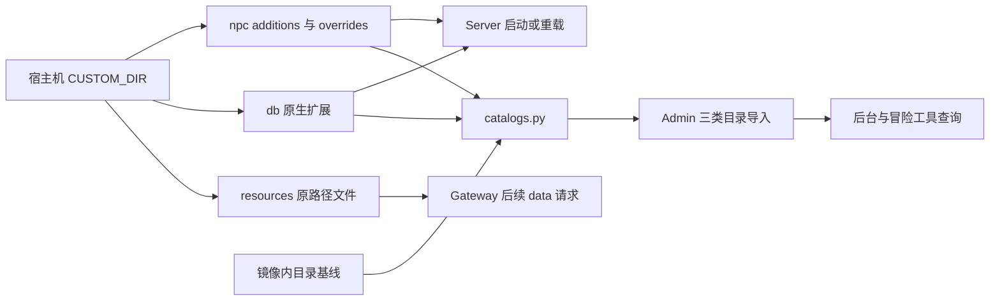

# 自定义功能的实现与维护

v0.4.0 增加用户维护的 NPC、数据库扩展和客户端资源目录，使修改可独立于镜像升级保存。使用方式见[部署手册](../operations/docker-deployment.md#服务端与资源自定义)，实际结果见[验收记录](../operations/acceptance-v0.4.0.md)。固定 PACKETVER=20211103、Renewal，不修改官方输入，也不从历史翻译目录发布。

## 本次增加了什么

| 层 | 实现位置 | 作用 |
| --- | --- | --- |
| 目录和挂载 | 根仓库 `deploy/docker/.env.example`、`compose.yml`、`custom-templates/` | 增加 CUSTOM_DIR；Server 挂载 npc/db，Gateway 挂载 resources，Admin 挂载整个 custom，全部只读 |
| 生命周期 | 根仓库 `tools/deployment/custom.py`、`manage.py` | 初始化只补缺少文件，校验目录，备份 custom-files.tar，恢复精确替换 |
| 服务端 NPC | Server 的 `src/map/npc_custom.hpp`、`npc.cpp`、`map.cpp` | 新增清单加载，按内置相对路径重定向 .txt 读取，保留原脚本身份 |
| 数据库 | Server 原生 db/import | 挂载用户 db 目录，沿用原生 YAML 合并、脚本及重载语义 |
| 资源请求 | Gateway 的 `src/controllers/clientController.js`、`src/routes/index.js` | data 请求先读 custom，绕过旧缓存，更新/删除影响后续请求 |
| 静态目录 | 根仓库 `tools/deployment/catalogs.py`、Admin entrypoint | 从内置基线和有效声明重建快照并执行三类导入 |
| NPC 空目录 | Admin 的 `backend/app/Services/GameData/JsonNpcSnapshotReader.php` | 合法空 NPC 目录允许清除旧条目，缺失必要字段仍失败 |

本次不需要新增客户端协议；PWA 沿用原有游戏封包、资源 URL 和冒险工具接口。客户端名称、说明、SPR/ACT 映射及后台缩略图不由服务端 YAML 自动生成。

## 数据流

游戏重载和资料刷新是独立流程。刷新不执行 NPC 脚本，不生成服务端 runtime 副本，不以后台查询成功推断游戏脚本或掉落已生效。

## NPC 如何接入

HAPPYRO_CUSTOM_NPC_PATH 指向 `/opt/happyro/custom/npc`。新增脚本只从 scripts.conf 显式登记，支持 `npc: additions/xxx.txt` 和 `import: additions/xxx.conf`；子清单仍以 custom/npc 为根，不递归扫描任意文件。路径校验拒绝越界、符号链接和循环 import。

内置 `npc/cities/prontera.txt` 的候选覆盖是 `overrides/cities/prontera.txt`。加载时替换读取源，但保留原逻辑文件名，因此启动、`@reloadscript`、`@loadnpc` 一致，`@unloadnpcfile` 仍按原文件定位；`@unloadnpc` 接受 NPC 名称。覆盖不是再加载一遍同名 NPC。仅注释文件可停用定义，删除覆盖恢复当前镜像版本；未被内置清单引用的旧覆盖不会自动启用。

有问题的覆盖不能静默回退内置内容，日志须暴露错误。重载会中断对话，并非失败时可自动回滚的事务。

## 资源与资料刷新

Gateway 的 CUSTOM_RESOURCE_PATH 指向 resources 挂载。相对路径对应客户端 data/ 下的原路径，不能额外嵌套 data/。自定义读取发生在进程缓存和原资源读取之前；启用 custom 的 data 响应使用 no-store，更新产生新 ETag，删除回退内置来源。路径和链接错误返回错误，不读取挂载外文件。浏览器已缓存或游戏已解码的图片仍需重新加载。

Admin 镜像保留物品/魔物/NPC 基线和 Server 的 npc/conf 快照。catalogs.py 按有效清单筛选静态 NPC，对覆盖文件重新解析声明；新 NPC 只有坐标寻路能力，不凭空生成官方导航 ID。物品/魔物读取 item_db.yml、mob_db.yml 及 Renewal Imports；全部解析成功后才写快照，再执行原有三条导入命令。三次数据库导入不是跨目录事务，后续导入失败时修复输入并重新刷新，不能宣称自动回滚。

每次从镜像内基线重建，删除 custom 条目后可清除旧资料。解析器不执行动态 NPC 或物品脚本、不预测奖励，也不覆盖所有原生数据库类型。合法空 NPC 目录可导入；物品/魔物空目录被拒绝。

## 首次部署缺陷与修复

首轮 Admin 刷新读取 conf/script_athena.conf 引用的 conf/import/script_conf.txt 时失败。该目录被 Docker 构建上下文排除；Server 启动会从 import-tmpl 创建，Admin 快照没有初始化，导致 admin-init 退出 1。

根仓库修复提交 `2179b923` 在 Admin Dockerfile 中将版本化 conf/import-tmpl 复制到快照的 conf/import，与 Server 默认初始化一致，没有增加忽略缺失文件的分支。实际容器定向验证后，四类镜像全部再次无缓存双架构重建，最终包仅含第二轮产物。

## 打包、升级与恢复约束

- prepare 只复制发行模板和 Server import-tmpl，不读取用户 custom；package 拒绝 .env、实际 custom/、非空 data/ 和符号链接。
- initialize-custom 不合并、不改写已有文件。新版模板不会自动改变用户已有模板，需要按升级说明审查 Header、语法和依赖。
- 升级复用 DATA_DIR/CUSTOM_DIR 的持久绝对路径，替换整套发行包。未覆盖内容随镜像更新，覆盖文件仍使用用户版本，也不会自动获得上游修复。
- 后台战斗设置只保存在 DATA_DIR/server-settings，不引入第二份配置来源。
- 备份先停写；restore 校验备份，再恢复数据库、后台文件、custom。custom 会移除备份以外文件，但整个恢复流程不是原子事务；中途失败应保持停服，用匹配包和完整备份恢复。

## 后续维护

产品逻辑继续改对应独立仓库，部署编排和解析器改根仓库。不要通过改容器内脚本、生成服务端 runtime 树或复制用户 custom 到发行包实现新需求。

修改模板、挂载、NPC 解析或 Gateway 优先级时，同步检查初始化幂等、删除回退、路径拒绝、重复导入及备份精确恢复。源码测试可运行 `python3 -m unittest discover -s tools/deployment -p 'test_*.py'`；还须按[验收清单](../../todo.md)完成容器和游戏检查。构建流程见[镜像构建与交付](../operations/docker-release.md)。
